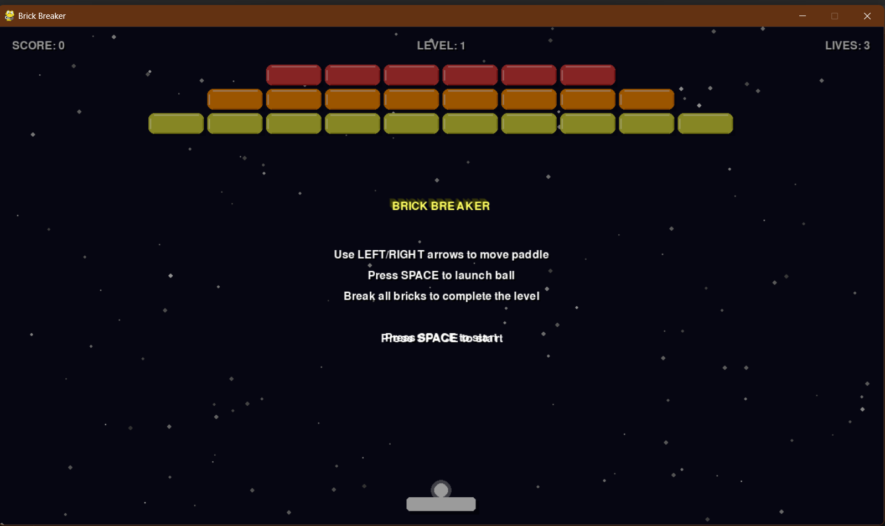
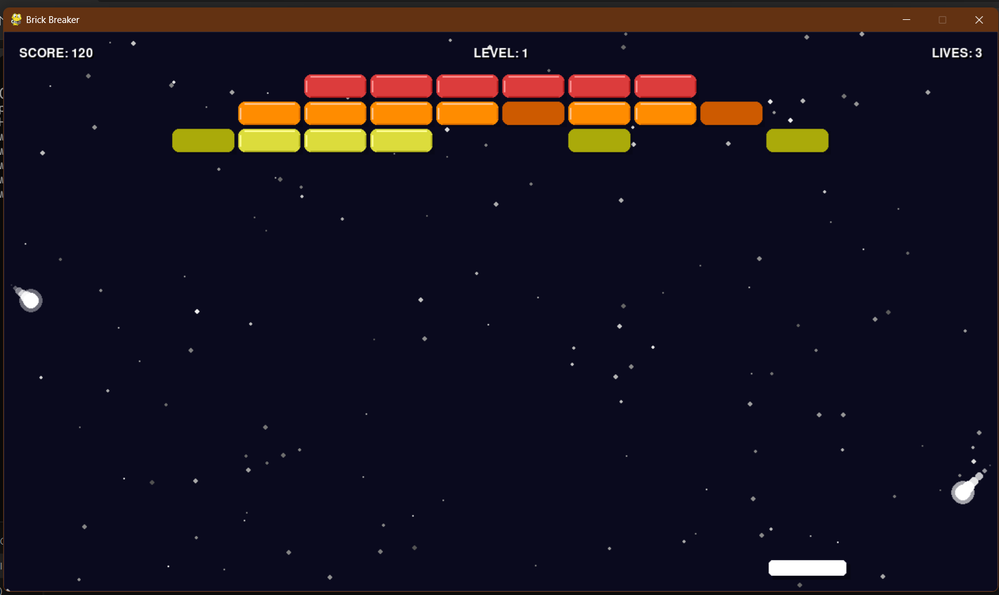

# Brick Breaker — Built with Amazon Q Developer CLI

A retro‑style **Brick Breaker** arcade game generated almost entirely via chat prompts to **Amazon Q Developer CLI**. This project was created for the *Build Games with Amazon Q CLI* challenge — publish your build, tag it with **#AmazonQCLI**, and earn a limited‑edition T‑shirt!

---

## Table of contents

1. [Gameplay overview](#gameplay-overview)
2. [Screenshots](#screenshots)
3. [Features](#features)
4. [Controls](#controls)
5. [Quick start](#quick-start)
6. [Prompts used](#prompts-used)
7. [Lessons learned](#lessons-learned)
8. [Contributing](#contributing)
9. [License](#license)

---

## Gameplay overview

Brick Breaker challenges you to clear coloured brick patterns with a bouncing ball while keeping your paddle in play. Power‑ups such as **Wider Paddle**, **Multi‑Ball**, and **Slow Motion** add variety across three handcrafted JSON levels. The game runs at a silky‑smooth 60 FPS in a 1280 × 720 window and ships with CC‑0 pixel art and 8‑bit sound FX.

## Screenshots

Put your PNGs (e.g. `title.png`, `gameplay.png`) in **docs/screenshots/** and they’ll render automatically.

```markdown


```

## Features

- Classic paddle‑and‑ball mechanics with angle‑based reflections
- Three difficulty‑curated levels defined in **levels/** (easy to extend)
- Four configurable power‑ups (drop‑rate in `settings.py`)
- Heads‑Up Display for score, lives, and level number
- Pause / restart support and game‑over screen
- 100 % Python 3.12 + PyGame 2.x — no other dependencies
- Fully type‑hinted, PEP‑8‑compliant codebase with unit tests in **tests/**

## Controls

| Key       | Action                  |
| --------- | ----------------------- |
| **← / →** | Move paddle             |
| **Space** | Launch or relaunch ball |
| **P**     | Pause / unpause         |
| **Esc**   | Quit                    |

## Quick start

```bash
# 1 · clone the repo
$ git clone https://github.com/<your‑user>/brick‑breaker.git
$ cd brick‑breaker

# 2 · create & activate a virtual environment (Ubuntu 24.04 ships Python 3.12)
$ sudo apt update && sudo apt install python3‑venv -y  # one‑time
$ python3 -m venv .venv
$ source .venv/bin/activate

# 3 · install requirements & run
(.venv) $ pip install -r requirements.txt
(.venv) $ python src/main.py
```

### Makefile shortcuts

```bash
make run    # activate venv + launch game
make test   # run pytest suite
```

## Prompts used

Below are the *actual* prompts sent to Amazon Q CLI — include them in your blog/video to satisfy the challenge requirements.

```text
Hey Q! ✨ I’d love your help building a small retro‑style Brick Breaker game in Python 3.11 …
```

```text
Awesome, thanks! Let’s flesh it out:
• Paddle, ball physics …
```

```text
Last stretch! Could you …
```

## Lessons learned

- **Iterative prompting beats monoliths.** Splitting work across multiple prompts helped Q generate coherent, well‑structured code. Q helped debug the mechanics of game easily.
- **File‑aware agentic mode is 🔥.** Q wrote and rewrote individual files without clobbering unrelated code.
- **Keep assets tiny.** Embedding CC‑0 pixel art keeps the repo lightweight for reviewers.

## Contributing

Pull requests are welcome! Please open an issue first and describe the feature or bug you’re tackling.

## License

This project is released under the MIT License. See [LICENSE](LICENSE) for full text.